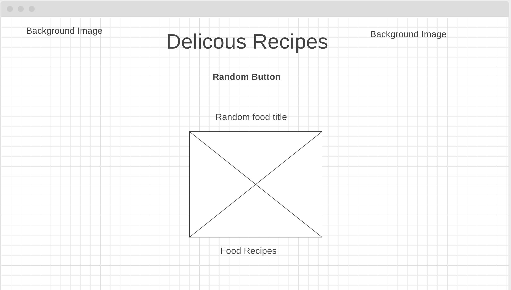
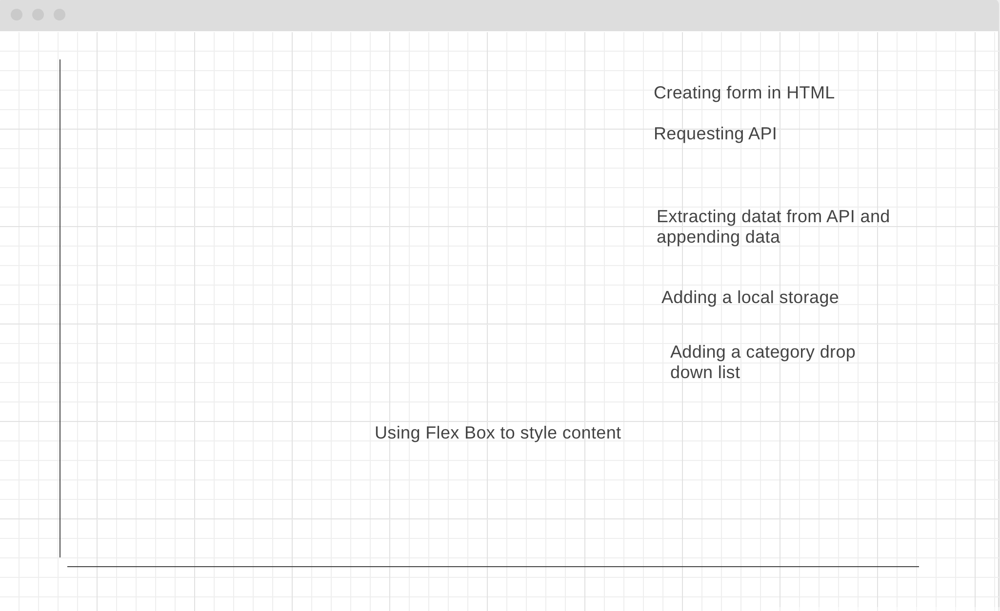

# Project Overview

## Project Name

[Delicous Recipes} (URL)

## Project Description
Not sure what to eat? Need some inspiration?
The Delicous Recipes project will allow user to click a random button to generate random food meals, their images, and a recipe for those meals.

## API and Data Sample
www.themealdb.com/api/json/v1/1/random.php

```{
    "meals": [
        {
            "idMeal": "52882",
            "strMeal": "Three Fish Pie",
            "strDrinkAlternate": null,
            "strCategory": "Seafood",
            "strArea": "British",
            "strInstructions": "Preheat the oven to 200C/400F/Gas 6 (180C fan).\r\nPut the potatoes into a saucepan of cold salted water. Bring up to the boil and simmer until completely tender. Drain well and then mash with the butter and milk. Add pepper and taste to check the seasoning. Add salt and more pepper if necessary.\r\nFor the fish filling, melt the butter in a saucepan, add the leeks and stir over the heat. Cover with a lid and simmer gently for 10 minutes, or until soft. Measure the flour into a small bowl. Add the wine and whisk together until smooth.\r\nAdd the milk to the leeks, bring to the boil and then add the wine mixture. Stir briskly until thickened. Season and add the parsley and fish. Stir over the heat for two minutes, then spoon into an ovenproof casserole. Scatter over the eggs. Allow to cool until firm.\r\nSpoon the mashed potatoes over the fish mixture and mark with a fork. Sprinkle with cheese.\r\nBake for 30-40 minutes, or until lightly golden-brown on top and bubbling around the edges.",
            "strMealThumb": "https://www.themealdb.com/images/media/meals/spswqs1511558697.jpg",
            "strTags": "Fish,Seafood,Dairy,Pie",
            "strYoutube": "https://www.youtube.com/watch?v=Ds1Jb8H5Sg8",
            "strIngredient1": "Potatoes",
            "strIngredient2": "Butter",
            "strIngredient3": "Milk",
            "strIngredient4": "Gruyère",
            "strIngredient5": "Butter",
            "strIngredient6": "Leek",
            "strIngredient7": "Plain Flour",
            "strIngredient8": "White Wine",
            "strIngredient9": "Milk",
            "strIngredient10": "Parsley",
            "strIngredient11": "Salmon",
            "strIngredient12": "Haddock",
            "strIngredient13": "Smoked Haddock",
            "strIngredient14": "Eggs",
            "strIngredient15": "",
            "strIngredient16": "",
            "strIngredient17": "",
            "strIngredient18": "",
            "strIngredient19": "",
            "strIngredient20": "",
            "strMeasure1": "1kg",
            "strMeasure2": "Knob",
            "strMeasure3": "Dash",
            "strMeasure4": "50g",
            "strMeasure5": "75g",
            "strMeasure6": "2 sliced",
            "strMeasure7": "75g",
            "strMeasure8": "150ml",
            "strMeasure9": "568ml",
            "strMeasure10": "2 tbs chopped",
            "strMeasure11": "250g",
            "strMeasure12": "250g",
            "strMeasure13": "250g",
            "strMeasure14": "6",
            "strMeasure15": "",
            "strMeasure16": "",
            "strMeasure17": "",
            "strMeasure18": "",
            "strMeasure19": "",
            "strMeasure20": "",
            "strSource": "https://www.bbc.co.uk/food/recipes/three_fish_pie_58875",
            "strImageSource": null,
            "strCreativeCommonsConfirmed": null,
            "dateModified": null
        }
    ]
}


## Wireframes




#### MVP 

- Render 3rd party API data to show title, image, and recipe.
- user will be able to click on a button to reveal random recipe
- Use mediaQuery to adjust to users screen size

#### PostMVP  
*These are examples only. Replace with your own Post-MVP features.*

- Add second API
- Add a youtube link for each random recipe

## Project Schedule
 
|  Day | Deliverable | Status
|---|---| ---|
|June 21| Prompt / Wireframes / Priority Matrix / Timeframes | Incomplete
|June 22| Project Approval / Core Application Structure (HTML, CSS, etc.) | Incomplete
|June 23| Pseudocode / actual code | Incomplete
|June 24| Initial Clickable Model  | Incomplete
|June 25| MVP | Incomplete
|June 28| Presentations | Incomplete

## Priority Matrix



## Timeframes


| Component | Priority | Estimated Time | Time Invested | Actual Time |
| --- | :---: |  :---: | :---: | :---: |
| Adding Form | H | 3hrs| 3.5hrs |  |
| Building HTML content | H | 3hrs| 2.5hrs |  |
| Working with API | H | 3hrs| 2.5hrs |  |
| Appending data to page| H | 3hrs| 2.5hrs |  |
| Styling the form| H | 3hrs| 2.5hrs |  |
| styling the appended data | H | 3hrs| 2.5hrs |  |
| Adding background images | H | 3hrs| 2.5hrs |  |
| Appending youtube links| H | 3hrs| 2.5hrs |  |
| Adding a category list for food items | H | 3hrs| 2.5hrs |  |

| Total | H | 27hrs| 26hrs |  |

## Code Snippet

Use this section to include a brief code snippet of functionality that you are proud of and a brief description.  

```
function reverse(string) {
	// here is the code to reverse a string of text
}
```

## Change Log
 Use this section to document what changes were made and the reasoning behind those changes.  
